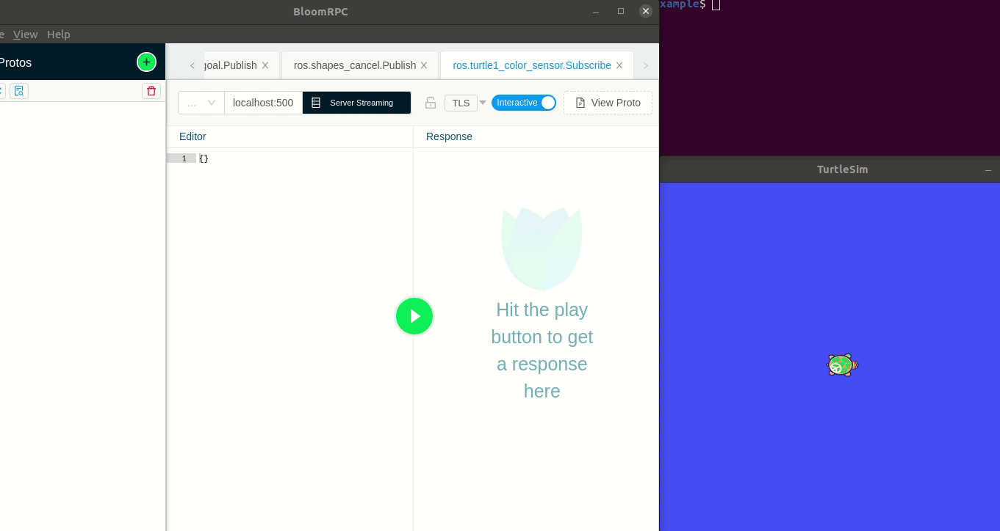

# ROS - gRPC bridge generator
### *Experimental gRPC server generator to mirror arbitrary ROS topics and services*

 - [How it works?](#how-it-works?)
 - [Notes](#notes)
 - [Install](#install)
 - [Usage](#usage)
 - [Example](#example)
 - [Development](#development)
 - [Tests](#tests)
 - [Notes on the snapshot file](#notes-on-the-snapshot-file)


 
## How it works?
 - The script creates a snapshot of all the running ROS topics and services available at the moment,
 - then generates a standalone package in your catkin workspace which implements the gRPC server as a ROS node.
 
## Notes
 - Protobuf has no equivalent for constants in ROS messages so they are added as comments to the proto message definitions.
 - `uint8[]` and `char[]` ROS array types are represented as `bytes` in Protobuf (like in the [python msg generator](http://docs.ros.org/indigo/api/rospy_message_converter/html/namespacerospy__message__converter_1_1message__converter.html#ab92670982d5f9db6e765deff0ed9eeff))
 - Only ROS Noetic is supported (because it needs python3) 
 - The whole generator is implemented as a Jupyter notebook and a cookiecutter template so feel free to try changes and suggest modifications :)

## Install
Clone the repo into a catkin workspace:
```sh
# in your_catkit_ws/src
git clone https://github.com/azazdeaz/ros-grpc-bridge-generator.git
```
install dependencies and build
```sh
# in your_catkit_ws
rosdep update
rosdep install --from-paths src --ignore-src -r -y
catkin_make
```

## Usage
1. #### Start the necessary ROS nodes to make the topics and services visible.

2. #### Generate the server
```sh
roslaunch grpc_bridge_generator generate.launch pkg_name:=grpc_bridge
# now, the new pkg should be in your workspace
# install its deps and build it:
rosdep install --from-paths src --ignore-src -r -y
catkin_make
```
 - see the available arguments in [generate.launch](launch/generate.launch)

3. #### Run the generated server
```sh
roslaunch grpc_bridge server.launch
```
- see the available arguments in [server.launch](template/{{cookiecutter.pkg_name}}/launch/grpc_server.launch)

## Example

You can find an example catkin workspace at https://github.com/azazdeaz/ros-grpc-bridge-generator-example

## Development
The script is implemented as a Jupyter Notebook, so it's quite easy to poke around and tailor the generator for your project.

To launch the editor, just run:
```
rosrun grpc_bridge_generator notebook
```
Executing this notebook is equivalent to running `generate.launch`.

## Tests

The end-to-end tests are a bunch of snapshot files in the test/snapshots folder and their pre-generated packages in the test/expected folder.

Running `rostest grpc_bridge_generator generate.test` will regenerate these packages in the test/result folder and compare them with the expected folder. It will fail for any changes. To update the tests just override the files in the expected folder.

To add a new test, copy a snapshot file in test/snapshots, run the tests, and move the generated pkg from the result to the expected folder.

There are also some doctests in the generate.ipynb but only to make the development easier. They will run with the notebook.

## Notes on the snapshot file
 - It's an ini file (python configparse format) used as the only source for the gRPC server generator
 - Generated by default but can be edited manually
 - You can tell the generate script to use an edited snapshot instead of generating a new one [(see options)](launch/generate.launch)
 - Has three sections: `TOPICS`, `SERVICES`, and `MESSAGE_DEFINITIONS`
 - Keys are ordered alphabetically for easier editing/diffing
 - Nested message definitions are flattened
